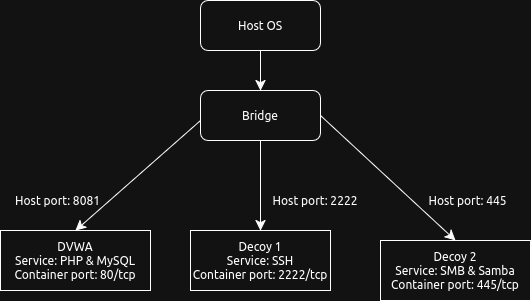

# Sprint 1 - blue team

### Vulnerable service

Service name: dvwa

Service type: vulnerable

Docker image to use: [vulnerables/web-dvwa:latest](https://hub.docker.com/r/vulnerables/web-dvwa), [mysql:5.7](https://hub.docker.com/r/mysql)

Intended exposed container port: 8081/tcp

Description & rationale: This is a very vulnerable web app made with PHP & MySQL. I chose it because it has some common web vulnerabilities.

### Decoy service 1

Service name: cowrie

Service type: decoy

Docker image to use: [cowrie/cowrie:latest](https://hub.docker.com/r/cowrie/cowrie)

Intended exposed container port: 2222/tcp

Description & rationale: This is an SSH honeypot. I chose it because it's used a lot in industry. It would appear as a weak SSH server to an attacker.

### Decoy service 2

Service name: smb

Service type: decoy

Docker images to use: [demisto/smb:latest](https://hub.docker.com/r/demisto/smb), [dockurr/samba:latest](https://hub.docker.com/r/dockurr/samba)

Intended exposed container port: 445/tcp

Description & rationale: This is an SMB server. I chose it because I know smb is a secure protocol that would not be easily attacked. It would just appear as the most recent version of Samba and smb.

`docker-compose.yml`:

```yaml
version: "4.0"

networks:
  blue_team_net:
    driver: bridge
    name: blue_team_net

services:
  dvwa:
    image: vulnerables/web-dvwa:latest
    container_name: dvwa
    networks:
      - blue_team_net
    depends_on:
      - dvwa_db
    ports:
      - "8081:80"
    restart: unless-stopped
    environment:
      - MYSQL_HOST=dvwa_db
      - MYSQL_USER=dvwa
      - MYSQL_PASSWORD=dvwa
      - MYSQL_DATABASE=dvwa

  dvwa_db:
    image: mysql:5.7
    container_name: dvwa_db
    networks:
      - blue_team_net
    environment:
      - MYSQL_ROOT_PASSWORD: rootpassword
      - MYSQL_DATABASE=dvwa
      - MYSQL_USER=dvwa
      - MYSQL_PASSWORD=dvwa
    volumes:
      - dvwa_db_data:/var/lib/mysql
    restart:unless-stopped

  cowrie:
    image: cowrie/cowrie:latest
    container_name: cowrie
    networks:
      - blue_team_net
    ports:
      - "2222:2222"
    environment:
      COWRIE_TTYLOG_ENABLED: "true"
      COWRIE_DOWNLOADS_ENABLED: "true"
      COWRIE_SSH_LISTEN_PORT: "2222"
      COWRIE_TELNET_ENABLED: "false"
      COWRIE_HOSTNAME: "ssh-server"
      COWRIE_SSH_VERSION: "SSH-2.0-OpenSSH_8.9p1"
      COWRIE_USERDB_ENABLED: "true"
    volumes:
      - cowrie_data:/cowrie/var
      - cowrie_cfg:/cowrie/etc
    restart: unless-stopped

  smb:
    image: demisto/smb:latest
    container_name: smb
    hostname: smb
    detach: true
    restart: always

  samba:
    image: dockurr/samba:latest
    container_name: samba
    environment:
      NAME: "Data"
      USER: "samba"
      PASS: "habit's smb server"
    ports:
      - 445:445
    volumes:
      - ./samba:/storage
    restart: always
```


